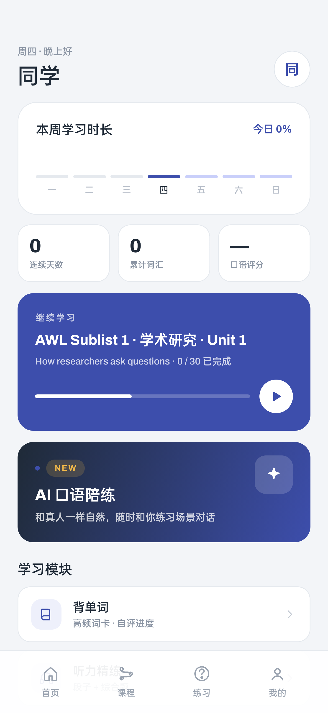
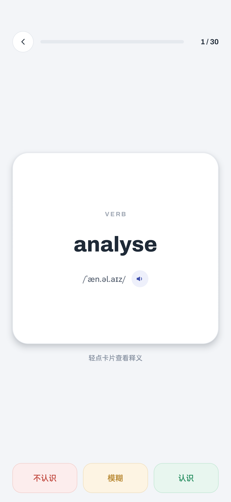
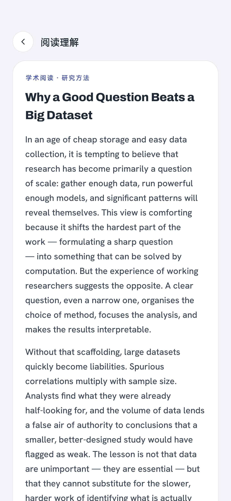
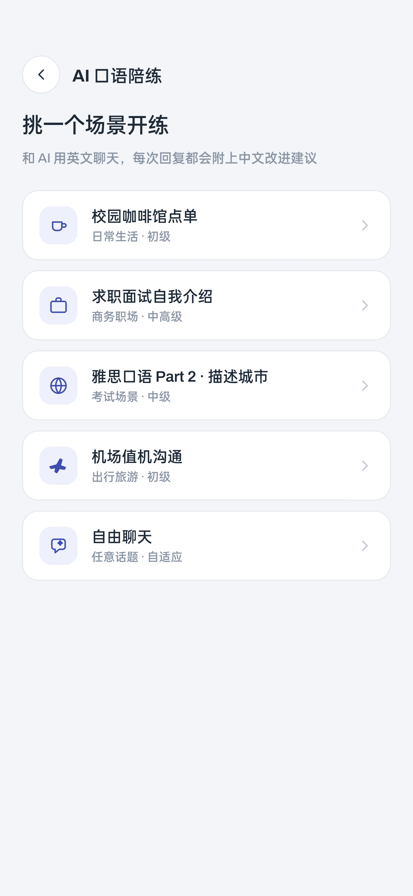

# Cairn · AWL 学术英语

围绕 **Academic Word List（学术词表）** 的安卓学习 App：背单词、听力精练、口语跟读、阅读理解、语法精讲、情景对话，外加一个会真正指出语法错误的 AI 口语陪练。

**完全免费，没有账号，学习进度只存在你的手机上。**

> 本仓库只发布安装包、更新说明和隐私政策。

## 下载安装

1. 到 [Releases](https://github.com/FUDAHA99/cairn-releases/releases/latest) 下载最新的 `cairn-vX.Y.apk`
2. 需要 Android 8.0 及以上
3. 首次安装系统会提示「来源未知」，允许即可

**更新**：直接安装新包覆盖旧版本，学习进度和设置都会保留。**不要先卸载**，卸载会清掉本地数据。有新版本时 App 首页会提示并给出下载链接。

## 功能

| 模块 | 说明 |
|---|---|
| 背单词 | AWL 449 个词头按 Sublist 分单元，自评「认识 / 模糊 / 不认识」，错题自动进错题本 |
| 听力精练 | 原创学术段落 + 综合题，音频打包在 App 里，**离线可听** |
| 口语跟读 | 标准句朗读 + 录音对比 |
| 阅读理解 | 学术短文，点词看释义 |
| 语法精讲 | 规则讲解 + 即学即练 |
| 情景对话 | 分支剧本、多轮交互 |
| AI 口语陪练 | 咖啡馆、面试、机场等场景对话；会指出你句子里的具体错误并给出改法；支持语音输入 |

## 截图

  
  
  
  

## 隐私

没有账号系统。学习进度、错题本、对话记录只存在本机，「我的 → 清除全部本地数据」可一键删除。
AI 陪练、语音识别、AI 回复朗读经我们自己的 Cloudflare Worker 处理；匿名使用统计经 PostHog。
完整说明见 [隐私政策](PRIVACY.md)。

## 反馈

- 提 [Issue](https://github.com/FUDAHA99/cairn-releases/issues)
- 邮件：cairn.app.support@gmail.com

## 已知限制

- 跟读评分尚未实现，跟读页面有标注
- 云端语音与 AI 陪练走免费额度，用量大时当天可能耗尽；App 会明确提示，背单词和离线听力不受影响

---

## English

Cairn is a free Android app for studying the **Academic Word List**: vocabulary, listening, read-aloud practice, reading, grammar, branching dialogues, and an AI speaking coach that points out the concrete mistakes in your sentences. No account; all progress stays on your device.

Download the latest `cairn-vX.Y.apk` from [Releases](https://github.com/FUDAHA99/cairn-releases/releases/latest) (Android 8.0+). Install a newer APK over the old one to update; your progress is kept. Privacy policy: [PRIVACY.md](PRIVACY.md). Feedback: [Issues](https://github.com/FUDAHA99/cairn-releases/issues) or cairn.app.support@gmail.com.
